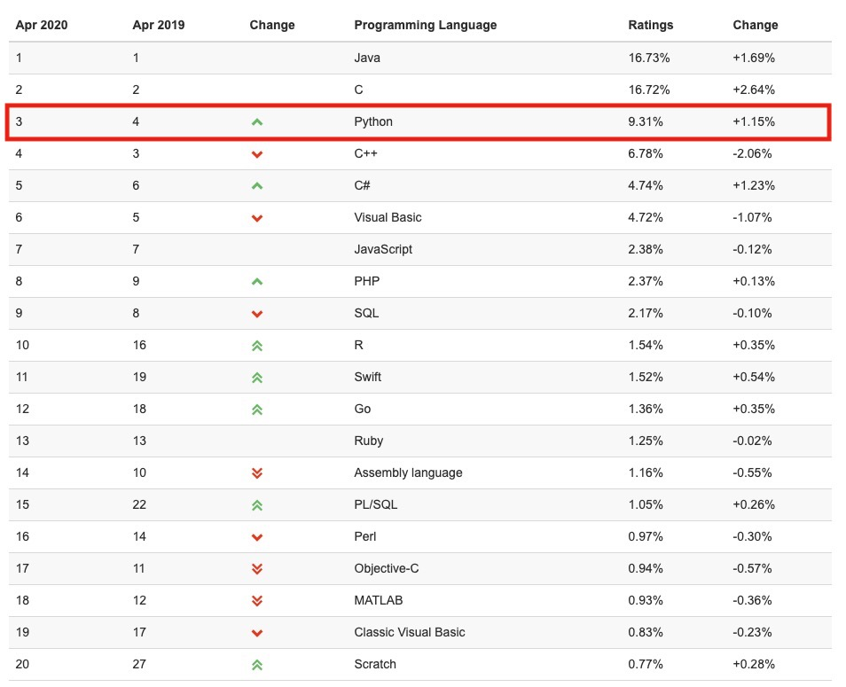
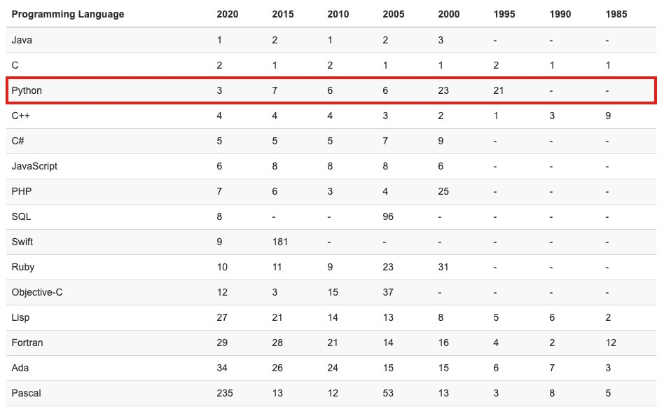
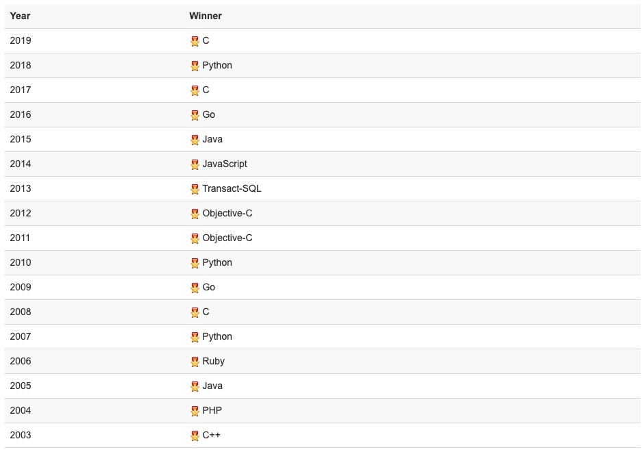

# Introduction of Python

Python 是一种具有动态语义的、解释型、面向对象的高级编程语言

- Python 的高级内置数据结构，结合动态类型和动态绑定，使其在快速应用程序开发方面非常具有吸引力，并且可用作脚本或粘合语言（glue language）将现有组件连接在一起
- Python 简单易学的语法强调可读性，因此降低了程序维护成本
- Python 支持模块和包，鼓励程序模块化和代码重用
- Python 解释器和广泛的标准库以源代码或二进制形式免费提供、免费分发，并用于所有主要平台

## Mainstream Programming Language Rankings

世界上的编程语言有 600 多种，但真正大家主流在使用的最多二三十种，不同的语言有自己的特点和擅长领域，随着计算机的不断发展，新语言在不断诞生，也同时有很多老旧的语言慢慢无人使用了

有个权威的语言排名网站 [TIOBE](https://www.tiobe.com/tiobe-index/)，可以看到主流的编程语言是哪些

### TIOBE Index for April 2020

### Very Long Term History

### Programming Language Hall of Fame 

Python 是一门优秀的综合语言， Python 的宗旨是简明、优雅、强大，在人工智能、云计算、金融分析、大数据开发、WEB 开发、自动化运维、测试等方向应用广泛，已是全球第 4 大最流行的语言

## Current Main Application Areas of Python

- **WEB 开发**，最火的 Python Web 框架 Django, 支持异步高并发的 Tornado 框架，短小精悍的 Flask 等
- **网络编程**，支持高并发的 Twisted 网络框架， py3 引入的 asyncio 使异步编程变的非常简单
- **爬虫**，爬虫领域，Python 几乎是霸主地位，Scrapy \ Request \ BeautifuSoap \ urllib 等
- **云计算**，目前最火最知名的云计算框架就是 OpenStack，Python 目前的热门，很大一部分就是因为云计算
- **自动化运维**，几乎是中国每位运维人员必备的语言
- **人工智能**，Python 是目前公认的人工智能和数据分析领域的必备语言，得益于其强大的计算库
- **金融分析**，许多趋势分析、高频交易软件都是基于 Python，到目前为止，Python 仍是金融分析、量化交易领域里使用率最高的语言
- **科学运算**，1997 年开始，NASA 就在大量使用 Python 进行各种复杂的科学运算，随着 NumPy，SciPy，Matplotlib，Enthought librarys 等众多程序库的开发，使得 Python 越来越适合于做科学计算，绘制高质量的 2D 和 3D 图像，和科学计算领域最流行的商业软件 Matlab 相比，Python 是一门通用的程序设计语言，比 Matlab 所采用的脚本语言的应用范围更广泛

