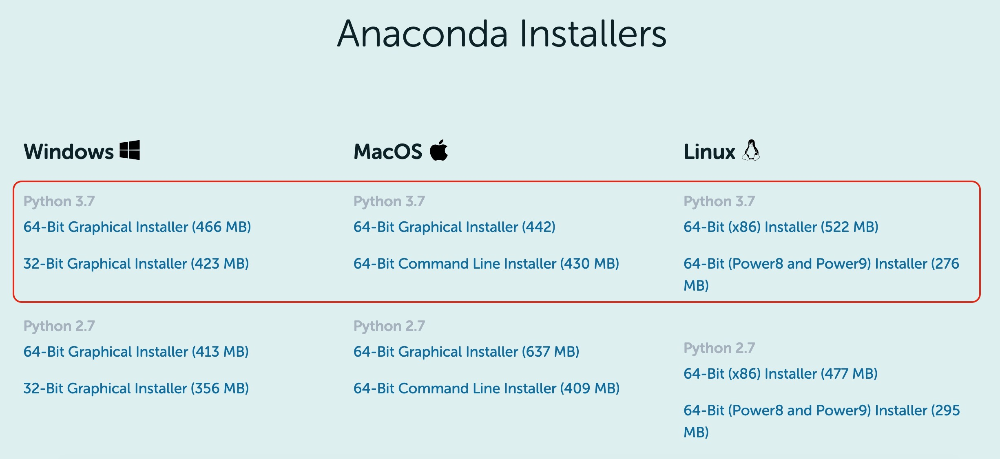
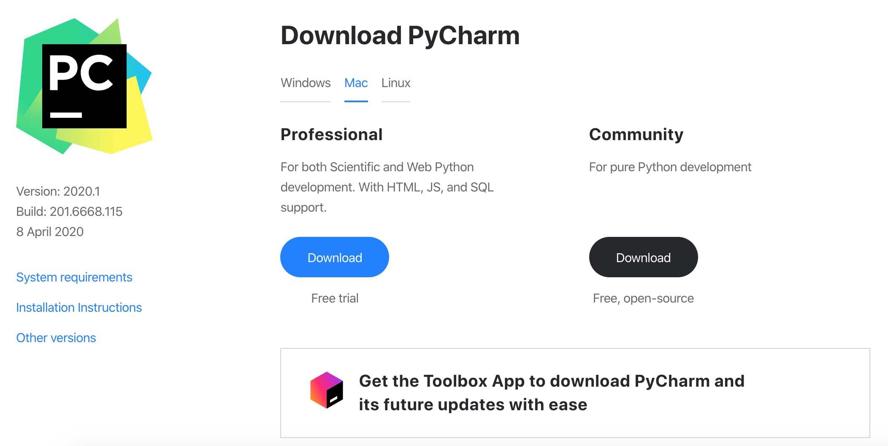
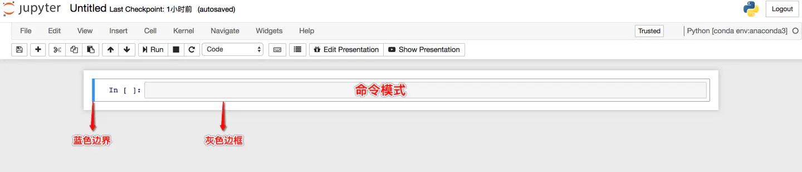
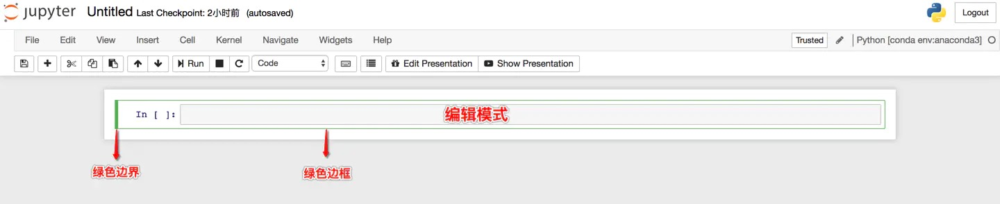

# Setup the Python Enviroment

本节讲一些 Python 的基础配置，是笔者习惯的配置，已有基础可以绕行

## About Anaconda

Anaconda 是一个用于科学计算的 Python 发行版，支持 Linux，Mac，Windows, 包含了众多流行的科学计算、数据分析的 Python 包

Anaconda 安装包可以到 [官网](https://www.anaconda.com/products/individual) 或者 [清华镜像](https://mirrors.tuna.tsinghua.edu.cn/anaconda/archive/?C=M&O=D) 下载

**注意** 我们选择 Python 3.X 的版本（比如目前是 3.7）



下载之后，除了想修改安装路径以外，基本都可以选择默认设置，一路 **Next**，不过，如果遇到如下选项，记得勾选

- [x] Add Anaconda to system PATH environment variable

安装结束后，打开命令行（Mac 的 Terminal，Windows 的 Anaconda Prompt 均可），输入 `conda --version`，出现版本号表示安装成功

```console
$ conda --version
conda 4.5.12
```

**Anaconda 仓库与第三方源**，各系统都可以通过修改用户目录下的 `.condarc` 文件来设置
Windows 用户无法直接创建名为 `.condarc` 的文件，可先执行 `conda config --set show_channel_urls yes` 生成该文件之后再修改

```console
channels:
  - defaults
show_channel_urls: true
channel_alias: https://mirrors.tuna.tsinghua.edu.cn/anaconda
default_channels:
  - https://mirrors.tuna.tsinghua.edu.cn/anaconda/pkgs/main
  - https://mirrors.tuna.tsinghua.edu.cn/anaconda/pkgs/free
  - https://mirrors.tuna.tsinghua.edu.cn/anaconda/pkgs/r
  - https://mirrors.tuna.tsinghua.edu.cn/anaconda/pkgs/pro
  - https://mirrors.tuna.tsinghua.edu.cn/anaconda/pkgs/msys2
custom_channels:
  conda-forge: https://mirrors.tuna.tsinghua.edu.cn/anaconda/cloud
  msys2: https://mirrors.tuna.tsinghua.edu.cn/anaconda/cloud
  bioconda: https://mirrors.tuna.tsinghua.edu.cn/anaconda/cloud
  menpo: https://mirrors.tuna.tsinghua.edu.cn/anaconda/cloud
  pytorch: https://mirrors.tuna.tsinghua.edu.cn/anaconda/cloud
  simpleitk: https://mirrors.tuna.tsinghua.edu.cn/anaconda/cloud
```

即可添加 Anaconda Python 免费仓库

运行 `conda clean -i` 清除索引缓存，保证用的是镜像站提供的索引

如果习惯软件式操作，可以打开 Anaconda 的软件，里面有众多应用，这里我们简单介绍其中两款

- **Spyder** 集成开发环境，类似于 Matlab
- **Jupyter** 基于网络的 Web 应用程序，可作为学习笔记本 

## About Pycharm

很多语言都有比较流行的开发工具，比如 JAVA 的 Eclipse，C# 与 C++ 的 Visual Studio，Go 语言的 Goland，那 Python 的是啥呢？答案就是 Pycharm

这是 PyCharm 的下载地址 http://www.jetbrains.com/pycharm/download/

之后页面会根据系统自动进入相应的下载页面



Professional 表示专业版，功能会更齐全一些，Community 是社区版，推荐安装社区版，因为是免费使用的，专业版是收费的，一年一千多，土豪请随意

## Conda Virtual Environment

在 Python 开发中，很多时候我们希望每个应用有一个独立的 Python 环境（比如应用 1 需要用到 TensorFlow 1.X，而应用 2 使用 TensorFlow 2.0，再比如我的某个应用需要用到 python 的不同版本），这时，Conda 虚拟环境即可为一个应用创建一套 “隔离” 的 Python 运行环境，使用 Python 的包管理器 conda 即可轻松地创建 Conda 虚拟环境，常用命令如下

```bash
conda create --name [env-name]      # 建立名为[env-name]的Conda虚拟环境
conda activate [env-name]           # 进入名为[env-name]的Conda虚拟环境
conda deactivate                    # 退出当前的Conda虚拟环境
conda env remove --name [env-name]  # 删除名为[env-name]的Conda虚拟环境
conda env list                      # 列出所有Conda虚拟环境
```

以下命令可以对 `conda` 以及 `anaconda` 更新， 但不建议频繁使用

```bash
conda update conda
conda update anaconda               # 需要先更新 conda
```

以下命令可以对 `python` 更新， 但不建议频繁使用

```bash
conda install python=3.7            # 3.7 为示例
```

此外虚拟环境还可以使用 virtualenv 等，这里不再展开

## pip and conda Package Managers

pip 是最为广泛使用的 Python 包管理器，可以帮助我们获得最新的 Python 包并进行管理

### pypi Image Help

pypi 镜像每 5 分钟同步一次

#### Temporary Use

```bash
pip install -i https://pypi.tuna.tsinghua.edu.cn/simple some-package
```

**注意**，`simple` 不能少, 是 `https` 而不是 `http`

#### Set as Default

升级 pip 到最新的版本 (`>=10.0.0`) 后进行配置

```bash
pip install pip -U
pip config set global.index-url https://pypi.tuna.tsinghua.edu.cn/simple
```

如果您到 pip 默认源的网络连接较差，临时使用本镜像站来升级 pip

```bash
pip install -i https://pypi.tuna.tsinghua.edu.cn/simple pip -U
```

### pip Common Commands

```bash
pip install [package-name]              # 安装名为[package-name]的包
pip install [package-name]==X.X         # 安装名为[package-name]的包并指定版本X.X
pip install [package-name] --proxy=代理服务器IP:端口号         # 使用代理服务器安装
pip install [package-name] --upgrade    # 更新名为[package-name]的包
pip uninstall [package-name]            # 删除名为[package-name]的包
pip list                                # 列出当前环境下已安装的所有包
```

### Update Python Package

经常更新 Python 包，就有一次需要更新很多个包的情况，目前没有一键升级功能

pip-review 就是为了解决这个问题的第三方包，安装方法如下

```shell
pip install pip-review
```

查看可用更新

```shell
pip-review
```

自动批量升级

```shell
pip-review --auto
```

以交互方式运行，对每个包进行升级

```shell
pip-review --interactive
```

### conda Package Manager

conda 包管理器是 Anaconda 自带的包管理器，可以帮助我们在 conda 环境下轻松地安装各种包，相较于 pip 而言，conda 的通用性更强（不仅是 Python 包，其他包如 CUDA Toolkit 和 cuDNN 也可以安装），但 conda 源的版本更新往往较慢，常用命令如下

```bash
conda install [package-name]        # 安装名为[package-name]的包
conda install [package-name]=X.X    # 安装名为[package-name]的包并指定版本X.X
conda update [package-name]         # 更新名为[package-name]的包
conda remove [package-name]         # 删除名为[package-name]的包
conda list                          # 列出当前环境下已安装的所有包
conda search [package-name]         # 列出名为[package-name]的包在conda源中的所有可用版本
```

conda 中配置代理，在用户目录下的 `.condarc` 文件中添加以下内容

```console
proxy_servers:
    http: http://代理服务器IP:端口号
```

## About Jupyter Notebook

> Jupyter Notebook 是基于网页的用于交互计算的应用程序，其可被应用于全过程计算，开发、文档编写、运行代码和展示结果 —— [Jupyter Notebook 官方介绍](https://jupyter-notebook.readthedocs.io/en/stable/notebook.html)

简而言之，Jupyter Notebook 是以网页的形式打开，可以在网页页面中直接编写代码和运行代码，代码的运行结果也会直接在代码块下显示，如在编程过程中需要编写说明文档，可在同一个页面中直接编写，便于作及时的说明和解释

### Installation of Jupyter Notebook

#### Install using Anaconda

我们可以通过安装 Anaconda 来解决 Jupyter Notebook 的安装问题，因为 Anaconda 已经自动为你安装了 Jupter Notebook 及其他工具，还有 python 中超过 180 个科学包及其依赖项

常规来说，安装了 Anaconda 发行版时已经自动为你安装了 Jupyter Notebook 的，但如果没有自动安装，那么就在终端（Linux 或 macOS 的 Terminal，Windows 的 Anaconda Prompt，以下均简称 **终端**）中输入以下命令安装

```bash
conda install jupyter notebook
```

#### Install using pip

如果你是有经验的 Python 玩家，可以用 `pip` 命令来安装 Jupyter Notebook，依次执行以下步骤即可

```bash
pip install --upgrade pip
```

**注意**，老版本的 `pip` 在安装 Jupyter Notebook 过程中或面临依赖项无法同步安装的问题，因此强烈建议先把 `pip` 升级到最新版本

再安装 Jupyter Notebook

```bash
pip install jupyter
```

### Run Jupyter Notebook

如果你有任何 Jupyter Notebook 命令的疑问，可以考虑查看官方帮助文档，命令如下

```bash
jupyter notebook --help
```

或者

```bash
jupyter notebook -h
```

在终端中输入以下命令，即可 **启动** Jupyter

```bash
jupyter notebook
```

执行命令之后，在终端中将会显示一系列 Notebook 的服务器信息，同时浏览器将会自动启动 Jupyter Notebook

启动过程中终端显示内容如下

```console
[I 16:57:25.472 NotebookApp] 启动notebooks 在本地路径: ******************************
[I 16:57:25.473 NotebookApp] 本程序运行在: http://localhost:8888/********************
[I 16:57:25.473 NotebookApp]  or http://127.0.0.1:8888/****************************
[I 16:57:25.473 NotebookApp] 使用control-c停止此服务器并关闭所有内核(两次跳过确认).
```

**注意**，之后在 Jupyter Notebook 的所有操作，都请保持终端不要关闭，因为一旦关闭终端，就会断开与本地服务器的链接，你将无法在 Jupyter Notebook 中进行其他操作

浏览器地址栏中默认地将会显示：http://localhost:8888，其中，**localhost** 指的是本机，**8888** 则是端口号

如果你同时启动了多个 Jupyter Notebook，由于默认端口 8888 被占用，因此地址栏中的数字将从 8888 起，每多启动一个 Jupyter Notebook 数字就加 1，如 8889，8890，...

如果你想自定义端口号来启动 Jupyter Notebook，可以在终端中输入以下命令

```bash
jupyter notebook --port <port_number>
```

其中，`<port_number>` 是自定义端口号，直接以数字的形式写在命令当中

### Two modes of the Jupyter Notebook

#### Command Mode

- 命令模式将键盘命令与 Jupyter Notebook 笔记本命令相结合，可以通过键盘不同键的组合运行笔记本的命令
- 按 Esc 键进入命令模式
- 命令模式下，单元格边框为灰色，且左侧边框线为蓝色粗线条



#### Edit Mode

- 编辑模式使用户可以在单元格内编辑代码或文档
- 按 Enter 或 Return 键进入编辑模式
- 编辑模式下，单元格边框和左侧边框线均为绿色



### Shortcut for Jupyter

#### Mac and Windows Special Keys Comparison Chart

| 符号	| Mac 按键	| Windows 按键 |
|:---  |:---       |:---         |
| ⌘	   | command	 | None        |
| ⌃	   | control	 | ctrl        |
| ⌥	   | option    | alt         |
| ⇧	   | shift	   | shift       |
| ↩	   | return	   | return      |
| ␣	   | space	   | space       |
| ⇥	   | tab	     | tab         |
| ⌫	   | delete	   | backspace   |
| ⌦	   | fn delete | delete      |

#### Shortcut under Command Mode

| 快捷键	 | 用途	  |
| :---    | :---  |
| F       | 查找和替换 |
| ↩	      | 进入编辑模式 |
| ⌘⇧F	    | 打开命令选项板 |
| ⌘⇧P	    | 打开命令选项板 |
| P	      | 打开命令选项板 |
| ⇧↩	    | 运行当前单元格并选中下一个单元格 |
| ⌃↩	    | 运行选中单元格 |
| ⌥↩	    | 运行当前单元格并且在下方插入单元格 |
| Y	      | **将单元格切换至 Code 状态** |
| M	      | **将单元格切换至 Markdown 状态** |
| R	      | 将单元格切换至 Raw 状态 |
| 1	      | 将单元格设定一级标题 |
| 2      	| 将单元格设定二级标题 |
| 3	      | 将单元格设定三级标题 |
| 4	      | 将单元格设定四级标题 |
| 5	      | 将单元格设定五级标题 |
| 6	      | 将单元格设定六级标题 |
| ↑	      | 选中上方单元格 |
| K	      | 选中上方单元格 |
| ↓	      | 选中下方单元格 |
| J	      | 选中下方单元格 |
| ⇧K	    | 向上多选单元格 |
| ⇧↑	    | 向上多选单元格 |
| ⇧J	    | 向下多选单元格 |
| ⇧↓	    | 向下多选单元格 |
| A	      | **在上方插入单元格** |
| B	      | **在下方插入单元格** |
| X	      | 剪切选中单元格 |
| C	      | 复制选中单元格 |
| ⇧V	    | 粘贴到上方单元格 |
| V	      | 粘贴到下方单元格 |
| Z	      | 撤销删除 |
| D, D	  | **删除选中单元格** |
| ⇧M	    | 合并选中单元格，若直选中一个则与下一个单元格合并 |
| ⌘S	    | 保存 |
| S	      | 保存 |
| L	      | 转换行号 |
| O	      | 转换输出 |
| ⇧O	    | 转换滚动输出 |
| H	      | 显示快捷键帮助 |
| I, I	  | 中断 Notebook 内核 |
| O, O	  | 重启 Notebook 内核 |
| ⇧L	    | 转换所有单元格行号且设置持续有效 |
| ⇧␣	    | 向上滚动 |
| ␣	      | 向下滚动 |

#### Shortcut under Edit Mode

| Mac 快捷键	| Windows 快捷键	| 用途 |
|:---        |:---            |:--- |
| ⇥	         | ⇥	            | **代码补全或缩进** |
| ⇧⇥	       | ⇧⇥	            | **提示** |
| ⌘]	       | ⌃]	            | **向后缩进** |
| ⌘[	       | ⌃[	            | **向前缩进** |
| ⌘A	       | ⌃A	            | **全选** |
| ⌘Z	       | ⌃Z	            | **撤销** |
| ⌘/		     |                | **注释** |
| ⌘D		     |                | **删除该行内容** |
| ⌘U	       |                | **撤销** |
| ⌘↑	       | ⌃↑	            | 光标跳转至单元格起始位置 |
| ⌘↓	       | ⌃↓	            | 光标跳转至单元格最终位置 |
| ⌥←	       | ⌃←	            | 光标位置左移一个单词 |
| ⌥→	       | ⌃→	            | 光标位置右移一个单词 |
| ⌥⌫	       | ⌃⌫	            | 删除前边一个单词 |
| ⌥⌦	       | ⌃⌦	            | 删除后边一个单词 |
| ⌘⇧Z	       | ⌃Y	            | 重做 |
| ⌘⇧U	       | ⌃⇧Z	          | 重做 |
| ⌘⌫	       | ⌃⌫	            | 删除该行光标左边内容 |
| ⌘⌦	       | ⌃⌦	            | 删除该行光标右边内容 |
| ⌃M         | 	⌃M	          | 进入命令模式 |
| esc	       | esc	          | 进入命令模式 |
| ⌘⇧F	       | 	              | 打开命令选项板 |
| ⌘⇧P	       | 	              | 打开命令选项板 |
| ⇧↩	       | ⇧↩	            | 运行当前单元格并选中下一个单元格 |
| ⌃↩	       | ⌃↩	            | 运行选中单元格 |
| ⌥↩	       | ⌥↩	            | 运行当前单元格并且在下方插入单元格 |
| ⌃⇧-	       | ⌃⇧-	          | 以光标所在位置分割单元格 |
| ⌘S	       | ⌃S	            | 保存 |
| ↓	         | ↓	            | 下移光标 |
| ↑	         | ↑	            | 上移光标 |
