# Anaconda and Pycharm Installation

如果在安装 Anaconda 或者 Pycharm 时感到困难，可以参考如下在 Windows 环境下的安装过程，否则请跳过本节

## About Anaconda

参考安装步骤

进入欢迎页面

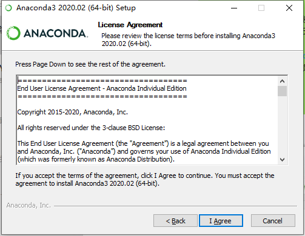

同意协议

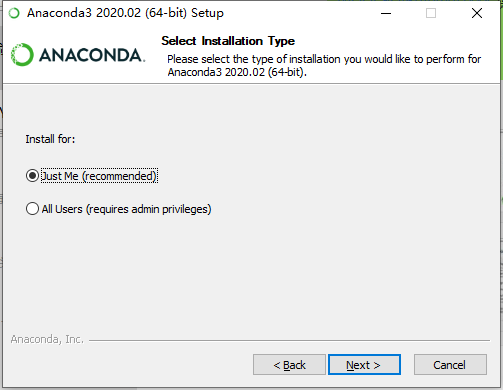

两个选项差别不大

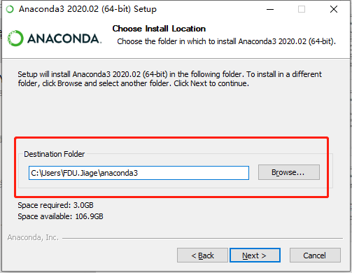

跟换路径也可以，但请不要出现中文，最好还是一个名为 `anaconda3` 的文件夹

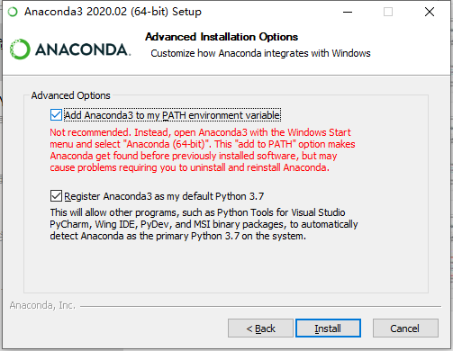

将 Anaconda3 **添加至环境变量**，后续也可以自行设置

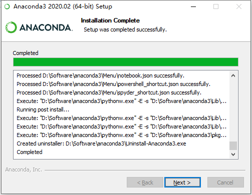

等待安装完成

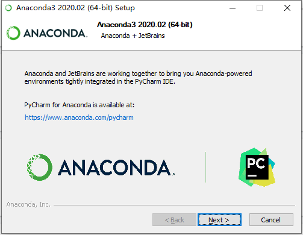

推荐安装 Pycharm

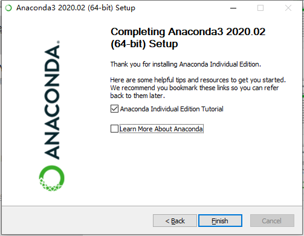

安装完成

## About Pycharm

如果是 Python 的初学者，可以不用安装

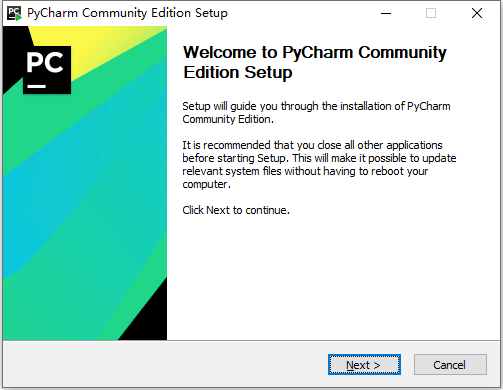

进入欢迎页面

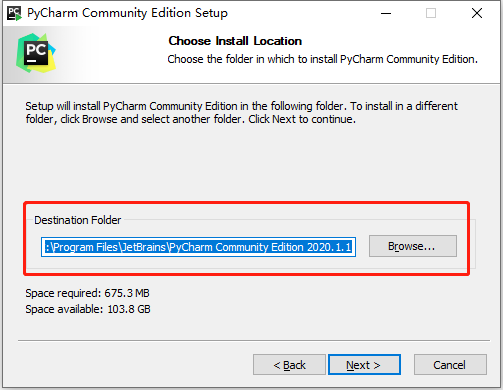

跟换路径也可以，但请不要出现中文

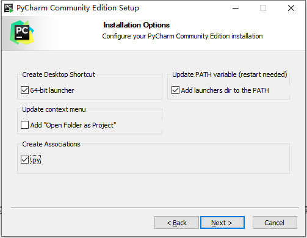

按照需求进行个性化设置，建议增加环境变量

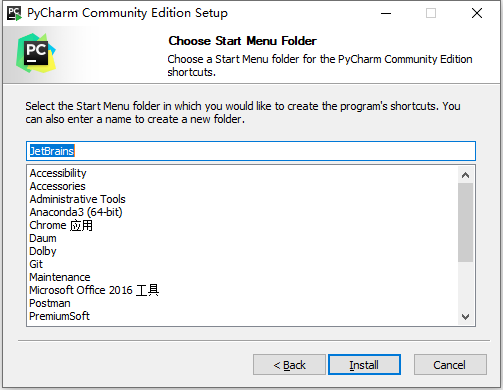

等待安装的过程忘记截图了，完成之后会在开始菜单创建一个文件夹，默认就行

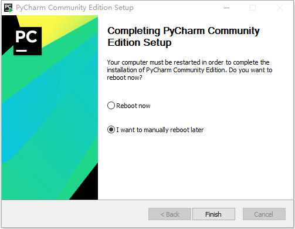

进行 Pycharm 后续的设置

同意协议即可

**注意** 进入 Anaconda 和 Pycharm 后可以进行一些适合自己的配置，布局以及快捷键等，由于时间有限，这块不再展开，建议用时自行搜索即可
