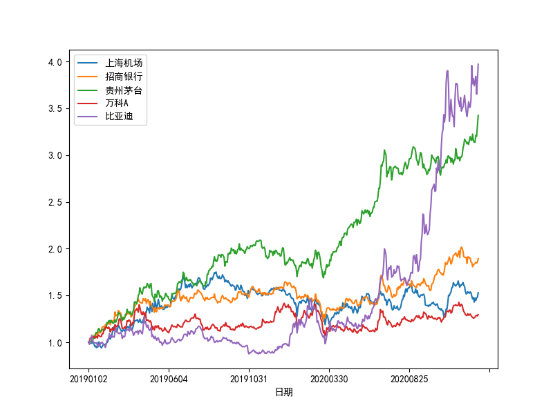
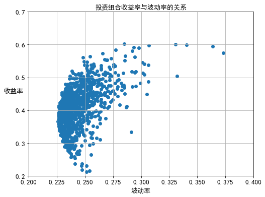

# Stock Portfolio

在现代金融学中，投资组合理论占据极其重要的地位，该理论的开山鼻祖是 Harry Markowitz，并于 20 世纪 50 年代最早提出，时至今日，在涉及投资组合的研究与实践中依然广泛运用该理论

## Key Variables of the Portfolio

假设存在一个投资组合，它由 N 只股票构成，描述一个投资组合需要用到包括投资组合的预期收益率以及投资组合收益率的波动率这两个重要变量

### Expected Rate of Return on the Portfolio

投资组合的预期收益率，可以由以下公式得出

$$
\begin{aligned}
E(R_P) &= E(\sum_{i=1}^N \omega_i R_i) = \sum_{i=1}^N \omega_i E(R_i) \\
&=[\omega_1,\omega_2,\cdots,\omega_N][E(R_1),E(R_2),\cdots,E(R_N)]^T
\end{aligned} \tag{5-1}
$$

其中，

$$
\begin{aligned}
&E(R_P) : 投资组合的预期收益率 \\
&\omega_i : 投资组合中第\ i\ 只股票所占的权重，通常是运用股票的市值占投资组合整体市值的比例，且\ \sum_{i=1}^N \omega_i=1 \\
& E(R_i) : 投资组合中第\ i\ 只股票的预期收益率，通常是运用该股票过去收益率的均值代替 \\
& [\omega_1,\omega_2,\cdots,\omega_N] : 每只股票权重的向量（行向量）\\
& [E(R_1),E(R_2),\cdots,E(R_N)]^T : 每只股票预期收益率的向量（列向量） 
\end{aligned}
$$

在计算股票收益率的时候，针对第\ i\ 只股票在第\ t\ 个交易日的收益率用如下式子表示，就可以将收益率变为连续复利的收益率

$$
R_tt = \ln \frac{P_{it}}{P_{it-1}} \tag{5-2}
$$

其中，

$$
\begin{aligned}
&P_{it}: 表示第\ i\ 只股票在\ t\ 时刻的价格 \\
&P_{it-1}: 表示第\ i\ 只股票在\ t-1\ 时刻的价格
\end{aligned}
$$

此外，在 Python 中，可以生成投资组合中每只股票的随机权重

```python
import numpy as np

x = np.random.random(5)         # 从均匀分布中随机抽取5个从0到1的随机数
weights = x/np.sum(x)           # 生成一个权重数组
print(weights)
print(round(sum(weights), 2))   # 验证生成的权重随机数是否合计等于1
```

输出

```console
[0.10220201 0.27353176 0.1263887  0.32700943 0.1708681 ]
1.0
```

### Portfolio Volatility (Risk)

在计算投资组合的波动率之前，需要首先计算得到每只股票收益率之间的协方差和相关系数

首先，考虑由两只股票组成的投资组合收益率的波动率（下文简称 **收益波动率** 或 **波动率**），具体的表达式如下

$$
\begin{aligned}
\sigma_P^2 &= \omega_1^2 + \omega_2^2 + 2\omega_1\omega_2Cov(R_1,R_2) \\
&= \omega_1^2 + \omega_2^2 + 2\omega_1\omega_2 \rho_{12}\sigma_1\sigma_2 
\end{aligned} \tag{5-3}
$$

等式 5-3 两边开根号就得到

$$
\begin{aligned}
\sigma_P^2 &= \sqrt{\omega_1^2 + \omega_2^2 + 2\omega_1\omega_2 Cov(R_1,R_2)} \\
&= \sqrt{\omega_1^2 + \omega_2^2 + 2\omega_1\omega_2 \rho_{12}\sigma_1\sigma_2} 
\end{aligned} \tag{5-4}
$$

其中，

$$
\begin{aligned}
&\sigma_P: 投资组合的收益波动率，也表示投资组合的风险 \\
&\sigma_1,\sigma_2: 第\ 1,2\ 只股票的收益波动率 \\
&Cov(R_1,R_2): 表示第\ 1,2\ 只股票收益率之间的协方差 \\
&\rho_{12}: 表示第\ 1,2\ 只股票收益率之间的相关系数
\end{aligned}
$$

从以上的公式不难发现，一个投资组合的波动率会受到组合中股票收益的相关系数影响

$$
\sigma_P = \left \{
\begin{aligned}
&\omega_1\sigma_1 + \omega_2\sigma_2,\quad &\rho_{12}=1 \\
&\vert\omega_1\sigma_1 - \omega_2\sigma_2\vert,\quad &\rho_{12}=-1 
\end{aligned}
\right. \tag{5-5}
$$

- 当完全线性正相关时，投资组合的收益波动率就是两只股票收益波动率的加权平均值
- 当完全线性负相关时，投资组合的收益波动率就是两只股票加权波动率之差的绝对值

接着，考虑由 N 只股票组成的投资组合的收益波动率，具体的表达式如下

$$
\begin{aligned}
\sigma_P^2 &= \sum_{i=1}^N\sum_{j=1}^N\omega_i \omega_j Cov(R_i, R_j) \\
&=\sum_{i=1}^N\sum_{j=1}^N\omega_i \omega_j\rho_{ij}\sigma_i\sigma_j
\end{aligned} \tag{5-6}
$$

两边开根号就可以得到

$$
\begin{aligned}
\sigma_P &= \sqrt{\sum_{i=1}^N\sum_{j=1}^N\omega_i \omega_j Cov(R_i, R_j)} \\
&=\sqrt{\sum_{i=1}^N\sum_{j=1}^N\omega_i \omega_j\rho_{ij}\sigma_i\sigma_j}
\end{aligned} \tag{5-7}
$$

其中，

$$
\begin{aligned}
&\sigma_i: 第\ i\ 只股票的收益波动率 \\
&Cov(R_i,R_j): 表示第\ i,j\ 只股票收益率之间的协方差 \\
&\rho_{ij}: 表示第\ i,j\ 只股票收益率之间的相关系数
\end{aligned}
$$

并且，

$$
\rho_{ij}=\frac{Cov(R_i,R_j)}{\sigma_i,\sigma_j} \tag{5-8}
$$

注意，

$$
\begin{aligned}
&当 i=j 时,\;Cov(R_i,R_j)=\sigma_i^2=\sigma_j^2,\; \rho_{ij}=1 \\
&当 i\neq j 时,\;Cov(R_i,R_j)=Cov(R_j,R_i),\; \rho_{ij}=\rho_{ji}
\end{aligned}
$$

由于涉及大量的计算，可以运用矩阵进行比较方便的计算，设如下符号

$$
\boldsymbol{\omega} = [\omega_1,\omega_2,\cdots,\omega_N],\quad
\boldsymbol{\Sigma}=\begin{bmatrix}
\sigma_1^2 & \sigma_{12} & \cdots & \sigma_{1N} \\
\sigma_{21} & \sigma_2^2 & \cdots & \sigma_{2N} \\
\vdots & \vdots & \ddots & \vdots \\
\sigma_{N1} & \sigma_{N2} & \cdots & \sigma_N^2 \\
\end{bmatrix},\quad
\sigma_{ij}=Cov(R_i,R_j)
$$

因此，投资组合收益波动率的表达式可以写成

$$
\sigma_P=\sqrt{\boldsymbol{\omega\Sigma\omega}^T} \tag{5-9}
$$

此外，波动率大致遵循平方根法则，并且按照交易日的天数计算，具体如下

$$
\begin{aligned}
周波动率 &= \sqrt{5} \times 日波动率 \\
月波动率 &= \sqrt{22} \times 日波动率 \\
年波动率 &= \sqrt{252} \times 日波动率 \\
\end{aligned}
$$

### Cases

下面通过基于A股市场的一个案例演示如何计算一个投资组合的收益率和波动率

【eg 5-1】假定投资组合配置了5只A股股票，数据是2019年至2021年期间的每个交易日收盘价格

|股票代码|600009|600036|600519|000002|002594|
|:---:|:---:|:---:|:---:|:---:|:---:|
|证券简称|上海机场|招商银行|贵州茅台|万科A|比亚迪|

#### Step 1

导入股票的收盘价格数据并且进行可视化

使用 Tushare [通用行情接口](https://tushare.pro/document/2?doc_id=109) 请求数据

```python
import tushare as ts
import pandas as pd

TOKEN="SET_YOUR_TOKEN"
ts.set_token(TOKEN)

# 设置股票列表
code_dict = {
    "600009.SH": "上海机场",
    "600036.SH": "招商银行",
    "600519.SH": "贵州茅台",
    "000002.SZ": "万科A",
    "002594.SZ": "比亚迪"
}
code_str = ",".join(code_dict.keys())

data = pd.DataFrame(columns=["trade_date"])
col_list = ["日期"]
start_date = "20190101"
end_date = "20201231"

for code_item in code_dict.keys():
    df_item = ts.pro_bar(
        ts_code=code_item,  # 股票标准代码
        asset="E",          # 资产类别：E股票
        adj="qfq",          # 复权类型
        start_date=start_date,
        end_date=end_date
    )
    # 根据日期合并每只标的的收盘信息
    data = pd.merge(data, df_item[["trade_date", "close"]], how="outer", on="trade_date")
    col_list.append(code_dict[code_item])

data.columns = col_list     # 重置列名 
data.sort_values(by=col_list[0], inplace=True)  # 按照日期升序排列
data.fillna(method='ffill', inplace=True)       # 根据前值替换NaN值
data.set_index(col_list[0], inplace=True, drop=True)    # 重新设置索引

print(data.head())  # 查看前5行数据
```

输出

```console
             上海机场     招商银行      贵州茅台      万科A      比亚迪
日期
20190102  49.4780  23.2058  583.4473  22.1556  48.9292
20190103  48.8102  23.4986  574.7002  22.3132  47.8246
20190104  48.9280  24.0936  586.3890  23.1104  50.4020
20190107  48.8888  24.1031  589.7885  23.2216  51.1383
20190108  48.9477  23.8197  589.1066  23.1753  52.6210
```

将股价按首个交易日进行归一化处理

```python
import matplotlib.pyplot as plt
plt.rcParams['font.sans-serif'] = ['SimHei']    # 用来正常显示中文标签
plt.rcParams['axes.unicode_minus'] = False      # 用来正常显示负号
(data/data.iloc[0]).plot(figsize=(8, 6))
plt.show()
```

得到股价从2019年至2020年的走势图（股价在2019年首个交易日归一化处理）



不难看出，走势还是存在一定的分化

#### Step 2

按照前面介绍的式子（5-2）构建这5只股票日收益率的时间序列

```python
R = np.log(data/data.shift(1))      # 按照对数收益率的计算公式得到股票收益率
R.dropna(inplace=True)              # 删除缺省的数据
R.describe()                        # 获取描述性统计分析内容
```

输出

```console
        上海机场        招商银行        贵州茅台        万科A       比亚迪
count  486.000000   486.000000     486.000000	  486.000000	486.000000
mean     0.000874     0.001314	     0.002533	    0.000533	  0.002838
std	     0.020815     0.017098	     0.018691	    0.018943	  0.030058
min	    -0.078063    -0.053487	    -0.082345	   -0.084568	 -0.105360
25%	    -0.011450    -0.008850	    -0.007831	   -0.010071	 -0.014553
50%	    -0.000570     0.000264	     0.001224	   -0.000733	  0.002545
75%	     0.012218     0.010733	     0.013105	    0.010287	  0.016757
max	     0.072245     0.095209	     0.057168	    0.079476	  0.095310
```

同时进行可视化

```python
# 将股票收益率按照直方图方式展示
R.hist(bins=np.linspace(-0.1, 0.1, 41, endpoint=True), figsize=(10, 10))
```

5只股票日收益率的直方图


#### Step 3

计算每只股票的平均收益率、波动率以及协方差，由于运用的是日数据，因此需要年化处理

- 计算股票的年化平均收益率（算术平均）

    ```python
    R_mean = R.mean() * 252
    print(R_mean)
    ```

    输出

    ```console
    上海机场    0.220226
    招商银行    0.331152
    贵州茅台    0.638269
    万科A     0.134196
    比亚迪     0.715052
    dtype: float64
    ```

- 计算股票的协方差矩阵并且年化处理

    ```python
    R_cov = R.cov() * 252
    print(R_cov)
    ```

    输出

    ```console
              上海机场      招商银行      贵州茅台       万科A       比亚迪
    上海机场   0.109177     0.039231     0.046936     0.041095     0.034059
    招商银行   0.039231     0.073669     0.037998     0.047372     0.030378
    贵州茅台   0.046936     0.037998     0.088034     0.031465     0.042686
    万科A     0.041095     0.047372     0.031465     0.090423     0.039524
    比亚迪    0.034059     0.030378     0.042686     0.039524     0.227678
    ```

- 计算股票的相关系数矩阵

    ```python
    R_corr = R.corr()
    print(R_corr)
    ```

    输出

    ```console
              上海机场      招商银行      贵州茅台       万科A       比亚迪
    上海机场   1.000000     0.437445     0.478754     0.413606     0.216027
    招商银行   0.437445     1.000000     0.471840     0.580415     0.234557
    贵州茅台   0.478754     0.471840     1.000000     0.352663     0.301510
    万科A     0.413606     0.580415     0.352663     1.000000     0.275459
    比亚迪    0.216027     0.234557     0.301510     0.275459     1.000000
    ```

- 计算股票收益率的年化波动率

    ```python
    R_vol = R.std() * np.sqrt(252)
    print(R_vol)
    ```

    输出

    ```console
    上海机场    0.330420
    招商银行    0.271421
    贵州茅台    0.296705
    万科A     0.300705
    比亚迪     0.477157
    dtype: float64
    ```

从以上的相关系数矩阵分析可以看到，这5只股票的收益率之间相关性不高，因此对于整个组合的分散化效果会比较好

#### Step 4

运用前面生成的随机权重数计算计算投资组合的预期收益率和收益波动率

```python
R_port = np.sum(weights * R_mean)
print("投资组合的预期收益率：{:.2%}".format(R_port))
vol_port = np.sqrt(np.dot(weights, np.dot(R_cov, weights.T)))
print("投资组合的收益波动率：{:.2%}".format(vol_port))
```

输出

```console
投资组合的预期收益率：35.98%
投资组合的收益波动率：23.35%
```

从以上的分析中可以得到，运用随机生成的权重计算得到该投资组合的预期收益率是35.98%/年，收益波动率是23.35%/年

## Effective Frontier of the Portfolio

从以上的分析不难发现，通过投资组合中的权重变化可以实现投资组合的预期收益率与收益波动率之间的映射关系

在投资组合理论中，所有可能的投资组合被称为可行集，有效前沿（efficient frontier）是可行集的一条包络线，它表示了在不同风险条件下能够给投资者带来的最高预期收益率，或者在不同预期收益率条件下能够给投资者带来的最低波动率（风险）

### Mapping Viable Sets

Python 可以非常方便地生成投资组合的权重随机数，然后再根据权重数生成相对应的投资组合预期收益率与波动率，并且进行可视化

【eg 5-2】沿用前例的信息，针对投资组合配置的5只股票，运用Python随机生成1000组权重的数组

```python
Rp_list = list()    # 建立一个初始的投资组合收益率数列
Vp_list = list()    # 建立一个初始的投资组合收益波动率数列
for i in np.arange(1000):
    # 生成1000个不同权重的预期收益率与收益波动率
    x = np.random.random(5)
    weights = x / sum(x)
    Rp_list.append(np.sum(weights*R_mean))
    Vp_list.append(np.sqrt(np.dot(weights, np.dot(R_cov, weights.T))))
```

进而绘制投资组合的可行集

```python
plt.figure(figsize=(8, 6))
plt.scatter(Vp_list, Rp_list)
plt.xlabel(u'波动率', fontsize=13)
plt.ylabel(u'收益率', fontsize=13, rotation=0)
plt.xticks(fontsize=13)
plt.yticks(fontsize=13)
plt.xlim(max(0, round(min(Vp_list) -0.05, 1)), round(max(Vp_list) + 0.05, 1))
plt.ylim(round(min(Rp_list) - 0.05, 1), round(max(Rp_list) + 0.05, 1))
plt.title(u'投资组合收益率与波动率的关系', fontsize=13)
plt.grid('True')
plt.show()
```



图中的散点就构成了一个可行集，在可行集内部，在波动率一定的情况下，理性的投资者一定会选择可行集最上方的点进行投资，因为可以实现预期收益率的最大化；同样，在预期收益率一定的情况下，理性投资者一定会选择可行集最左侧的点进行投资，因为可以实现收益波动率的最小化，也就是风险的最小化

### Building Effective Frontiers

其实，有效前沿就是求解以下这个最优方程式

$$
\min\limits_{w_i} \sigma_P
= \min\limits_{w_i} \sqrt{\sum\limits_{i=1}^N \sum\limits_{j=1}^N
w_i w_j Cov(R_i, R_j)} \tag{5-10}
$$

约束条件分别是

$$
\sum\limits_{i=1}^N w_i=1 \\
w_i>0 \\
E(R_p) = E(\sum\limits_{i=1}^N w_i R_i) = Const
$$

注意，其中第二条作为约束条件之一就表明不考虑股票卖空的情况（不考虑融券的情况）

在构建有效前沿的过程中，需要运用 SciPy 子模块 optimize 中的 minimize 函数

【eg 5-3】沿用前例信息，同事给定投资组合的预期收益率等于 50%，运用 Python 计算使得投资组合收益波动率最小情况下的每只股票的配置权重

```python
import scipy.optimize as sco

def f(w):
    # 定义一个需要求解最优化的函数
    w = np.array(w)              # 设置投资组合中每只股票的权重
    Rp_opt = np.sum(w * R_mean)  # 计算最优化投资组合的预期收益率
    Vp_opt = np.sqrt(np.dot(w, np.dot(R_cov, w.T)))     # 计算优化投资组合的收益波动率
    return np.array([Rp_opt, Vp_opt])                              # 以数组的格式输出

def Vmin_f(w):
    # 定义一个得到最小波动率的权重函数
    # 输出前面定义的函数f(w)结果的第二个元素
    return f(w)[1]

p_pct = 0.5      # 预期收益率等于50%
# 以字典格式依次输入权重的约束条件
cons = (
    {
        'type': 'eq',
        'fun': lambda x: np.sum(x) - 1
    },
    {
        'type': 'eq',
        'fun': lambda x: f(x)[0] - p_pct
    }
)
# 以元组格式输入权重的边界条件
bnds = tuple((0, 1) for x in range(len(R_mean)))

weights0 = len(R_mean) * [1.0 / len(R_mean), ]  # 用于生成一个权重相等的数组
result = sco.minimize(Vmin_f, weights0, method="SLSQP", bounds=bnds, constraints=cons)

for stock_item, idx in zip(R_mean.index, range(len(R_mean))):
    print("投资组合预期收益率{:.0%}时{}的权重: {:.4f}".format(p_pct, stock_item, result['x'][idx]))
```

输出

```console
投资组合预期收益率50%时上海机场的权重: 0.0420
投资组合预期收益率50%时招商银行的权重: 0.3208
投资组合预期收益率50%时贵州茅台的权重: 0.4369
投资组合预期收益率50%时万科A的权重: 0.0647
投资组合预期收益率50%时比亚迪的权重: 0.1356
```

通过计算得到，在投资组合的预期收益率 50% 时，实现投资组合收益波动率最小的股票权重分别是配置上海机场 4.2%，招商银行 32.08%，贵州茅台 43.69%，万科A 6.47% 以及比亚迪 13.56%

进一步而言，有效前沿的起点是在可行集中的投资组合收益波动率全局最小值和与之对应的投资组合预期收益率

【eg 5-4】计算该投资组合收益波动率的全局最小值，以及与该最小波动率相对应的预期收益率

```python
# 仅设置权重和等于1的约束条件
cons = (
    {
        'type': 'eq',
        'fun': lambda x: np.sum(x) - 1
    }
)

result_vmin = sco.minimize(Vmin_f, weights0, method="SLSQP", bounds=bnds, constraints=cons)
Rp_vmin = np.sum(R_mean * result_vmin['x'])
Vp_vmin = result_vmin['fun']

print("波动率在可行集是全局最小值时的投资组合预期收益率: {:.4f}".format(Rp_vmin))
print("在可行集是全局最小的波动率: {:.4f}".format(Vp_vmin))
```

输出

```console
波动率在可行集是全局最小值时的投资组合预期收益率: 0.3821
在可行集是全局最小的波动率: 0.2257
```

最后，给定投资组合的预期收益率是一个数组，就可以得到在投资组合收益波动率最小情况下，投资组合的每只股票配置权重以及对应的投资组合收益波动率，这些预期收益率和收益波动率的集合就构成了有效前沿

【eg 5-5】最终完成对有效前沿的创建并可视化

```python
Rp_target = np.linspace(Rp_vmin, max(Rp_list) + 0.1, 100)   # 生成投资组合的目标收益率数组
Vp_target = list()
for r in Rp_target:
    # 以字典格式依次输入预期收益率等于目标收益率的约束条件和权重的约束条件
    cons_new = (
        {
            'type': 'eq',
            'fun': lambda x: np.sum(x) - 1
        },
        {
            'type': 'eq',
            'fun': lambda x: f(x)[0] - r
        }
    )
    result_new = sco.minimize(Vmin_f, weights0, method="SLSQP", bounds=bnds, constraints=cons_new)
    Vp_target.append(result_new['fun'])

plt.figure(figsize=(8, 6))
plt.scatter(Vp_list, Rp_list)
plt.plot(Vp_target, Rp_target, 'r-', label=u'有效前沿', lw=2.5)
plt.plot(Vp_vmin, Rp_vmin, 'y*', label=u'全局最小波动率', markersize=14)
plt.xlabel(u'波动率', fontsize=13)
plt.ylabel(u'收益率', fontsize=13, rotation=0)
plt.xticks(fontsize=13)
plt.yticks(fontsize=13)
plt.xlim(max(0, round(min(Vp_list) -0.05, 1)), round(max(Vp_list) + 0.05, 1))
plt.ylim(round(min(Rp_list) - 0.05, 1), round(max(Rp_list) + 0.05, 1))
plt.title(u'投资组合的有效前沿', fontsize=13)
plt.legend(fontsize=13)
plt.grid('True')
plt.show()
```


可以看到，投资组合的有效前沿就是可行集的一条包络线，并且起点就是在可行集中投资组合收益波动率的全局最小值和与之对应的投资组合预期收益率所构成的点
